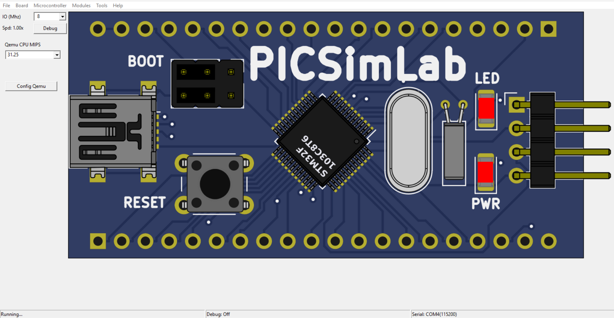
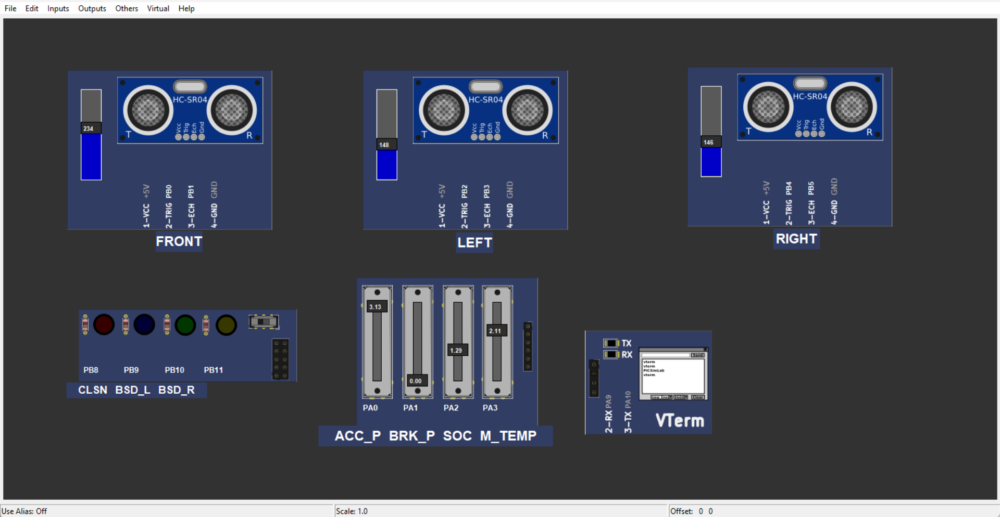
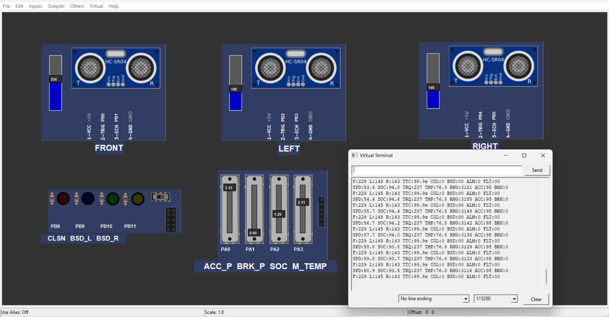
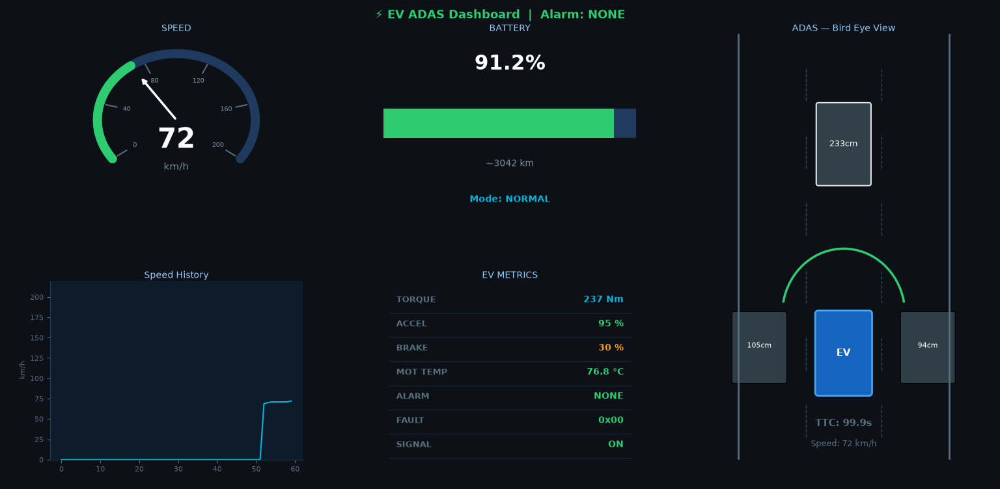
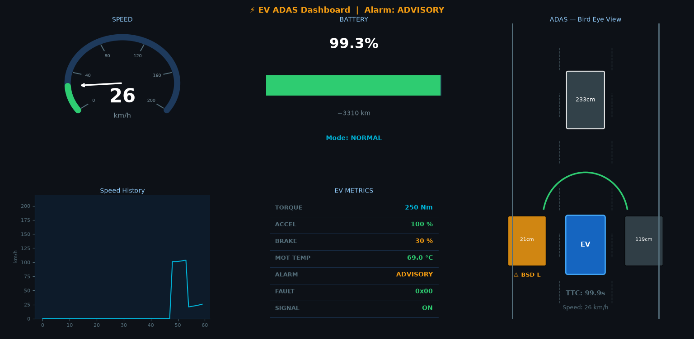
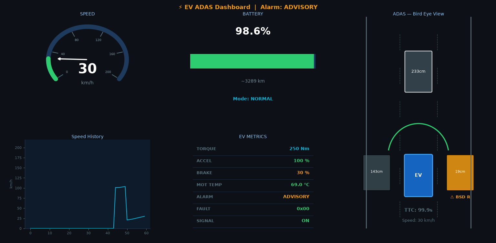
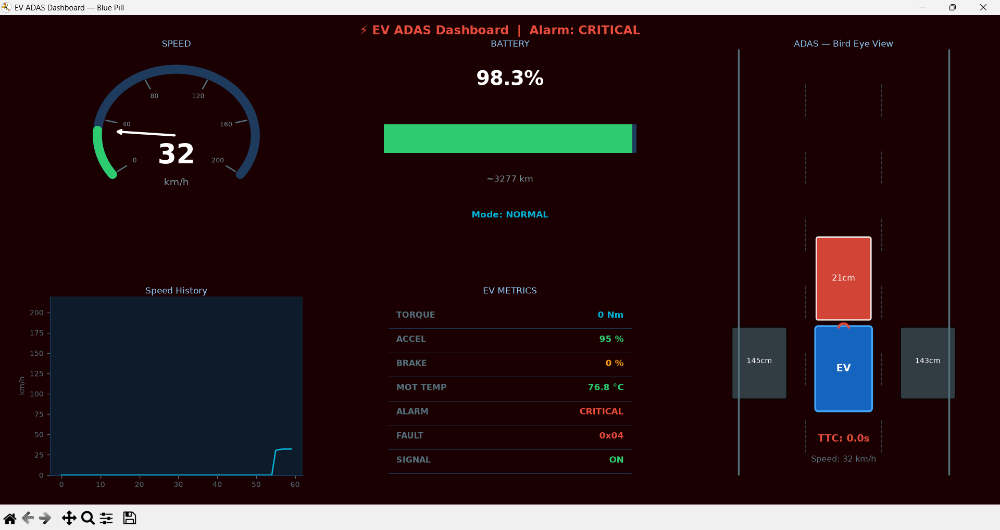
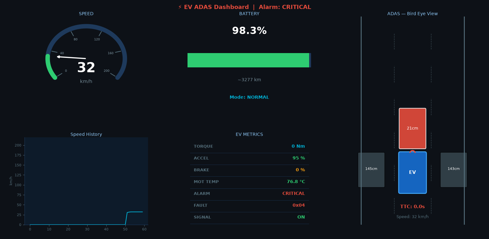
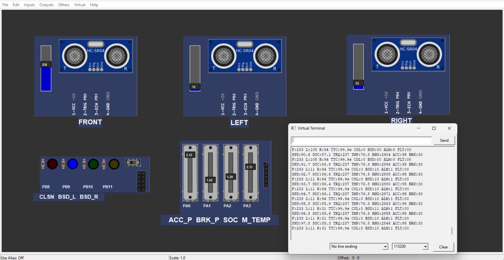
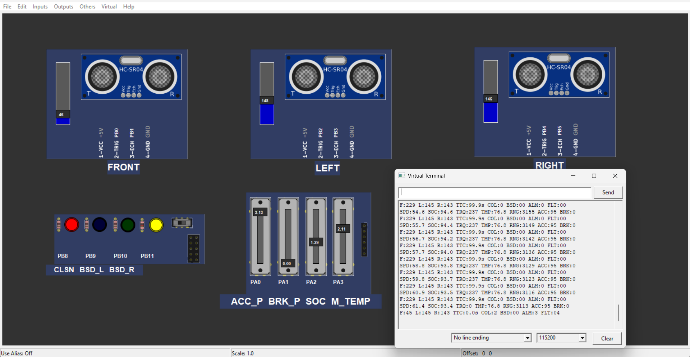

#  Real-Time EV Dashboard & ADAS Warning System

A real-time Electric Vehicle (EV) Dashboard integrated with an Advanced Driver Assistance System (ADAS), developed using **STM32**, **Python**, and **PicSimLab**. The system displays live vehicle telemetry and provides intelligent safety warnings through an interactive dashboard.

---

##  Project Overview

This project demonstrates the integration of embedded systems and desktop applications for EV monitoring. STM32 collects and transmits vehicle data via UART, while a Python dashboard visualizes the information in real time and displays ADAS warnings such as collision alerts, blind-spot detection, and fault notifications.

---

##  Features

-  Real-time Speed Monitoring
-  Battery Percentage Display
-  Motor Temperature Monitoring
-  State of Charge (SOC)
-  Speed History Graph
-  Collision Warning
-  Blind Spot Detection (Left & Right)
-  Critical & Warning Alerts
-  Fault Detection and Display
-  UART Communication between STM32 and Python
-  Interactive Python Dashboard
-  Hardware Simulation using PicSimLab

---

## 🛠 Hardware Used

- STM32 Blue Pill (STM32F103C8T6)
- Ultrasonic Sensors (HC-SR04)
- PC/Laptop
- UART Communication

---

##  Software Used

- STM32CubeIDE
- Python 3.x
- Matplotlib
- NumPy
- PySerial
- PicSimLab
- Visual Studio Code

---

##  Repository Structure

```
EV-Dashboard-ADAS-Warning-System
│
├── STM32_Code/
│   ├── Core/
│   ├── Drivers/
│   └── ev_dash.ioc
│
├── Python_Dashboard/
│   ├── EV_ADAS.py
│   └── EV_ADAS_Dashboard__Blue_Pill.png
│
├── PicSimLab/
│   ├── EV_ADAS Picsim.pzw
│   └── EV_ADAS PicsimWorkspace.pcf
│
├── Images/
│
└── README.md
```

---

##  Installation

### 1. Clone the Repository

```bash
git clone https://github.com/SakethKumar-27/EV-Dashboard-ADAS-Warning-System.git
```

### 2. Install Python Libraries

```bash
pip install pyserial numpy matplotlib
```

### 3. Open STM32 Project

- Open **STM32_Code** using STM32CubeIDE.
- Build and flash the firmware.

### 4. Open Python Dashboard

```bash
python EV_ADAS.py
```

### 5. Run PicSimLab

- Open the `.pzw` project file.
- Load the STM32 firmware.
- Start the simulation.

---

##  Project Screenshots

## Bluepill board


## Spareparts


## Virtualterminal


### Dashboard



### Blind Spot Detection





### Critical Warning



### Warning



### Fault Detection


.png)



---

##  Future Scope

- CAN Bus Integration
- GPS Tracking
- IoT Cloud Connectivity
- Mobile Application
- Voice Alerts
- AI-based Driver Assistance
- Real EV Hardware Integration

---

##  Applications

- Electric Vehicles
- Driver Assistance Systems
- Automotive Dashboard Development
- Embedded Systems Learning
- Smart Vehicle Monitoring

---

##  Developed By

**Saketh Kumar Bakki**

B.Tech – Electronics & Communication Engineering

Embedded Systems Enthusiast

---

##  License

This project is developed for educational and learning purposes.

---

##  Support

If you found this project useful, please consider giving it a ⭐ on GitHub.
